# 📦 Livrables du Lab MLOps : Lab 3 – Versionnement des données et pipelines ML avec DVC

## 📄 Compte Rendu  
**Réalisé par : Fahd El Attar**

Ce laboratoire a pour objectif d’introduire **DVC (Data Version Control)** afin de :
- Versionner les **datasets** sans alourdir Git
- Mettre en place un **remote de stockage**
- Construire un **pipeline ML reproductible**
- Garantir la **traçabilité et la reproductibilité** des expériences

---

## 🧪 Étape 1 : Initialisation de DVC dans le projet

Ouvrir un terminal dans le dossier du projet :

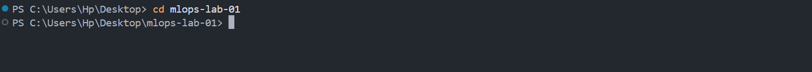

Initialiser DVC :

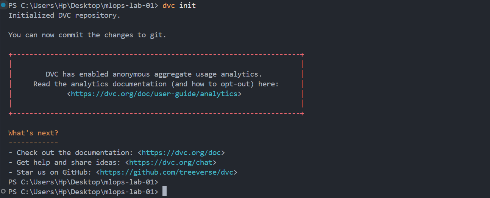

Vérifier les fichiers créés :

---

## 🧪 Étape 2 : Versionner les données brutes avec DVC

Versionner le dataset généré dans le lab précédent :

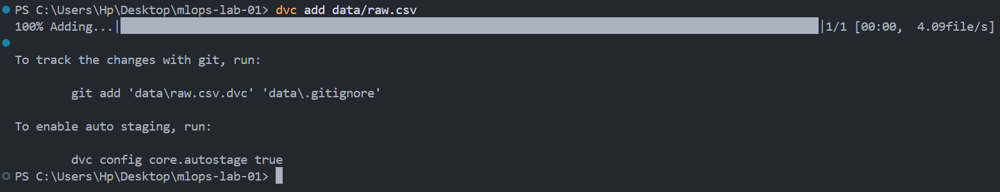

Afficher le contenu du dossier `data/` :

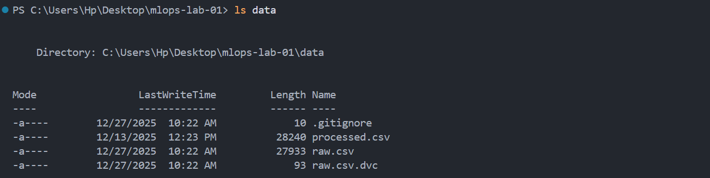

Ajouter les fichiers nécessaires au versionnement Git :

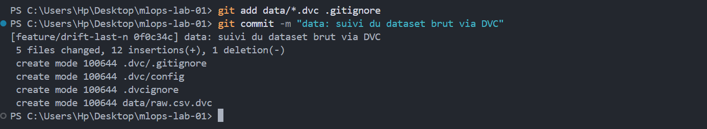

### ✅ Résultat attendu
- `data/raw.csv` **n’est plus suivi par Git**
- Seul `raw.csv.dvc` est versionné
- Git reste léger, **DVC gère les gros fichiers**

---

## 🧪 Étape 3 : Configuration d’un remote DVC

Créer un dossier pour le stockage distant :

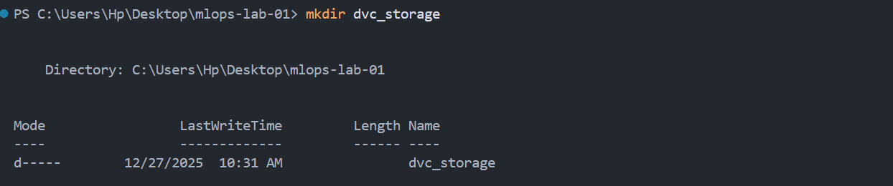

Déclarer le dossier comme remote principal :

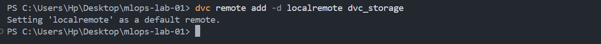

Versionner la configuration :

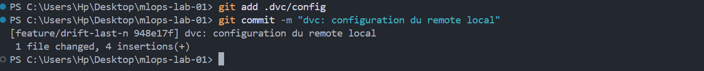

---

## 🧪 Étape 4 : Push des données vers le remote DVC

Envoyer les données vers le remote :

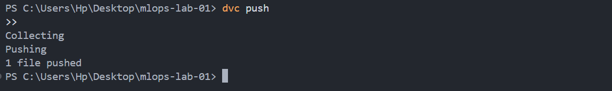

Vérifier que le dossier `dvc_storage/` contient des fichiers de hash :

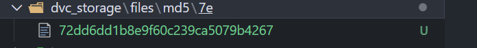

---

## 🧪 Étape 5 : Simulation d’une collaboration (suppression & récupération)

Supprimer localement le dataset :

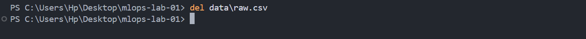

Vérifier que le fichier n’existe plus :

Récupérer les données depuis DVC :

---

## 🧪 Étape 6 : Versionner les données transformées

Ajouter les données transformées au suivi DVC :

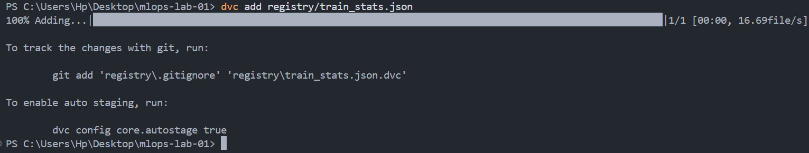

Puis :

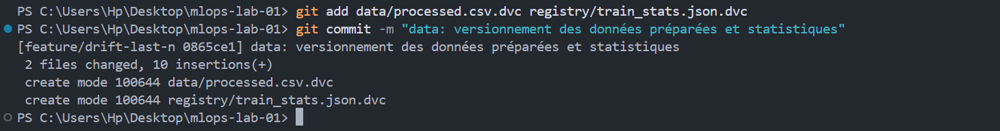

Enfin :

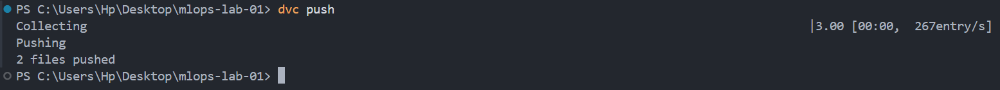

### ✅ Résultat attendu
Toutes les données nécessaires au **pipeline ML** sont versionnées proprement et traçables.

---

## 🧪 Étape 7 : Création d’un pipeline reproductible (`dvc.yaml`)

Créer le pipeline :

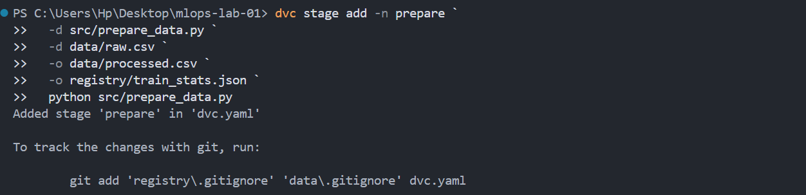

Ajouter l’étape d’entraînement :

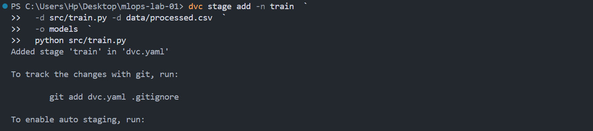

Ajouter l’évaluation du modèle :

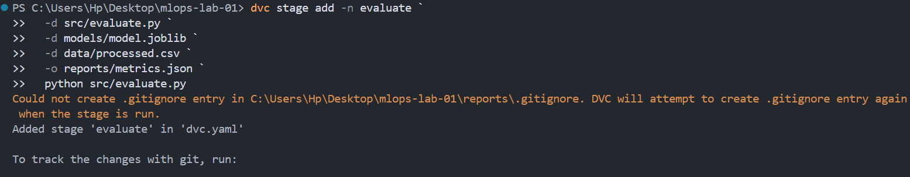

Versionner le pipeline :

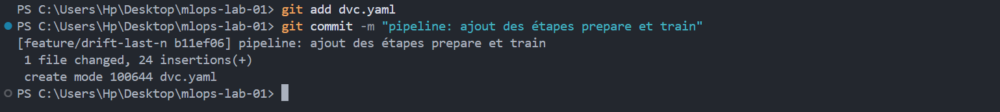

### ✅ Résultat attendu
DVC enregistre dans `dvc.yaml` :
- Les **dépendances**
- Les **sorties**
- Les **commandes** du pipeline

---

## 🧪 Étape 8 : Reproduction automatique du pipeline

Ajouter un `print` dans `src/prepare_data.py` :

Observer l’impact sur le pipeline :

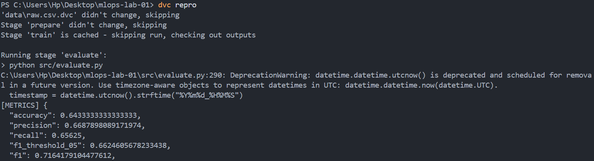

### ✅ Résultat attendu
Seules les **étapes impactées** sont réexécutées → **reproductibilité totale**.

---

## ✅ Conclusion

Ce lab démontre la puissance de **DVC** dans un contexte MLOps :

- Séparation claire entre **code, données et modèles**
- Versionnement efficace des datasets volumineux
- Pipelines **reproductibles et traçables**
- Base solide pour la collaboration et l’industrialisation ML

DVC devient ainsi un **pilier essentiel** d’un système MLOps fiable et professionnel.